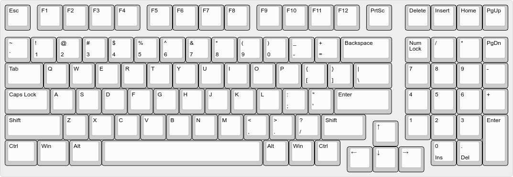

# PLAKey-1800

A custom designed gasket mounted keyboard using an 1800 layout with mostly 3d printed parts.
The electronics were hand-wired.

## Layout

## 3D Printed Parts

### 3d Printer requirements:
- Smooth heated surface
  - The parts are very large and a very good print surface is recommended to avoid warping
  - The top of the switchplate requires a smooth surface in order for the switches to seat properly without wobbling.
- Minimum 200mm print bed width/depth
  - This size is commonly available. 
  - Examples: most i3 printers, Ender 3

The printer I used for this project is a fully stock Prusa MK3s.

### Settings

In general, all of the parts were printed with .2mm layer height and no supports. All of the parts were designed so that they would not require supports to print.
All of the parts took around 24 hours of total print time.

- Switchplate:
  - The mounting points for MX keyswitches on the switchplate are 1.5mm and the rest of the switchplate is 2.7mm. The height of this part needs to be fairly accurate to ensure the switches are seated well. 
  - It's not critical to the keyboard, but it does help with the typing feel.
  - I recommend tuning the print settings on this part so that the plate comes out as close to the measurements as possible.

## Non-3d printed parts

Electronics
* Elite C V4 Microcontroller
    * The slot was designed for the b-stock run of this microcontroller (2mm pcb thickness vs normally 1.6mm)
* Wires
  * I used 18-20 gauge solid core wire and 28 gauge ribbon cable. 
  * I won't go into detail, but there are many guides on hand-wiring keyboards available.
* 1N4148 Diodes x100
* Keyswitches of your choice x100

Hardware
* 4-40 Heat Sink Threaded inserts
  * These can easily be inserted into the plastic components with a soldering iron.
* 4-40x5/8" Button Head screws
* 4-40x3/8" Countersunk Screws
* MX Keycap o-rings
  * This is for gasket mounting the switchplate.
* Full size stabilizer set
  * 4x2u, 1x6.25u
* (Optional) Included in the repository is a dxf file if you want to get a stronger backplate manufactured.
  * This is if you really like the design, but want a sturdier keyboard or a more solid typing feel.

### Cost

The total cost of the hardware comes to around $50 or less not including the switches (depending on what you may already have on hand.).
The mass of the 3d printed parts comes out to around 300g. A cheap filament is around $20/kg so around $6 of 3d printed plastic.

## Programming

QMK Firmware with VIA compatibility.

## Questions/Comments/Misc

### Contact

If you have any questions or comments, feel free to drop an issue on github.  
Or reach out to me on discord Magellan#8465

### Future Improvements
- Design switchplates for multiple layouts.
  - ISO
  - 2x1u slots instead of 1x2u on the macropad
  - If you want a custom layout for yourself the switchplate .dxf is included in the repository.
- Create a PCB layout for the keyboard
- Create a Group Buy for hardware/electronics in a kit
  - Maybe just a group buy for a metal switchplate
